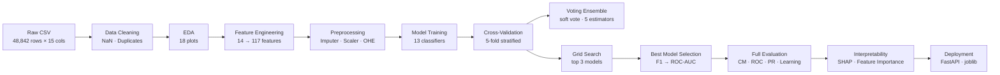
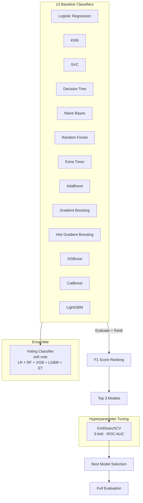

<p align="center">
  
  
  
  
  
  
</p>

<h1 align="center">Adult Census Income Prediction</h1>

<p align="center">
  <b>End-to-end ML pipeline predicting whether an individual earns >$50K/year<br>
  from 14 demographic & employment features using 14 classifiers + ensemble voting.</b>
</p>

---

## Table of Contents

- [Key Highlights](#key-highlights)
- [Workflow](#workflow)
- [Dataset](#dataset)
- [Methodology](#methodology)
  - [1. Data Cleaning](#1-data-cleaning)
  - [2. Feature Engineering](#2-feature-engineering)
  - [3. Preprocessing Pipeline](#3-preprocessing-pipeline)
  - [4. Modeling Strategy](#4-modeling-strategy)
- [Results](#results)
  - [Model Comparison](#model-comparison)
  - [Final Model — Tuned LightGBM](#final-model--tuned-lightgbm)
  - [Per-Class Breakdown](#per-class-breakdown)
- [Visualizations](#visualizations)
- [Project Structure](#project-structure)
- [Deployment](#deployment)
- [Generated Artifacts](#generated-artifacts)
- [Key Insights](#key-insights)
- [Future Work](#future-work)
- [Quick Start](#quick-start)

---

## Key Highlights

| Metric | Value |
|---|---|
| Models trained | **13 baselines + 1 ensemble** |
| Cross-validation | **5-fold stratified** |
| Hyperparameter search | **GridSearchCV (3-fold)** on top models |
| Best model | **LightGBM (Tuned)** |
| ROC-AUC | **0.9296** |
| Accuracy | **87.78%** |
| F1 Score (`>50K`) | **0.7278** |
| Feature count | **14 raw → 117 engineered** |
| Generated plots | **18 publication-quality figures** |

---

## Workflow



---

## Dataset

**Source:** [UCI Adult Data Set](https://archive.ics.uci.edu/ml/datasets/adult) — 48,842 census records.

| # | Feature | Type | Description |
|---|---|---|---|
| 1 | `age` | Numerical | Age in years |
| 2 | `workclass` | Categorical | Employment type (Private, Government, Self-employed…) |
| 3 | `fnlwgt` | Numerical | Census Bureau statistical weight |
| 4 | `education` | Categorical | Highest education level |
| 5 | `education.num` | Numerical | Numeric encoding of education |
| 6 | `marital.status` | Categorical | Marital status |
| 7 | `occupation` | Categorical | Job type |
| 8 | `relationship` | Categorical | Family relationship |
| 9 | `race` | Categorical | Race category |
| 10 | `sex` | Categorical | Gender |
| 11 | `capital.gain` | Numerical | Investment gains |
| 12 | `capital.loss` | Numerical | Investment losses |
| 13 | `hours.per.week` | Numerical | Avg weekly hours |
| 14 | `native.country` | Categorical | Country of origin |
| **15** | **`income`** | **Target** | **`<=50K` or `>50K`** |

---

## Methodology

### 1. Data Cleaning

- Replaced `?` placeholders with `NaN`
- Dropped duplicate rows
- Imputed missing values: **median** (numerical), **most frequent** (categorical)

### 2. Feature Engineering

Seven derived features were created from the raw data:

| New Feature | Logic |
|---|---|
| `age_group` | Binned: `<25`, `25–34`, `35–44`, `45–54`, `55–64`, `65+` |
| `hours_group` | Binned: `<20`, `20–29`, `30–39`, `40–49`, `50–59`, `60+` |
| `capital_total` | `capital.gain + capital.loss` |
| `has_capital` | Binary flag: 1 if any capital activity |
| `education_group` | Grouped education levels (Basic → Doctorate) |
| `marital_grouped` | Binary: `Married` vs `Not-Married` |
| `region` | Country mapped to continent (US/Canada, Central America, Asia, Europe…) |
| `edu_age_ratio` | `education.num / (age + 1)` — education density |

### 3. Preprocessing Pipeline

```python
ColumnTransformer([
    ('num', Pipeline([
        ('imputer', SimpleImputer(strategy='median')),
        ('scaler', RobustScaler())
    ]), numerical_features),
    ('cat', Pipeline([
        ('imputer', SimpleImputer(strategy='most_frequent')),
        ('encoder', OneHotEncoder(handle_unknown='ignore',
                                   sparse_output=False,
                                   max_categories=20))
    ]), categorical_features)
])
```

- **11 numerical** features → median imputation + `RobustScaler`
- **13 categorical** features → most-frequent imputation + `OneHotEncoder` (max 20 categories each, `handle_unknown='ignore'`)
- **Total post-encoding features: 117**

### 4. Modeling Strategy



All models were evaluated with **5-fold stratified cross-validation** and ranked by F1 score. The top 3 models underwent `GridSearchCV` hyperparameter tuning.

---

## Results

### Model Comparison

| Rank | Model | Accuracy | Precision | Recall | F1 Score | ROC-AUC | PR-AUC | CV ROC-AUC |
|---|---|---|---|---|---|---|---|---|
| 1 | **CatBoost** | 0.8791 | 0.7886 | 0.6805 | **0.7306** | 0.9319 | 0.8397 | 0.9266 |
| 2 | **LightGBM (Tuned)** | 0.8778 | 0.7857 | 0.6779 | 0.7278 | 0.9296 | 0.8352 | — |
| 3 | XGBoost | 0.8743 | 0.7717 | 0.6792 | 0.7225 | 0.9270 | 0.8302 | 0.9230 |
| 4 | LightGBM | 0.8740 | 0.7746 | 0.6728 | 0.7201 | 0.9291 | 0.8340 | 0.9255 |
| 5 | XGBoost (Tuned) | 0.8748 | 0.7846 | 0.6620 | 0.7181 | 0.9305 | 0.8377 | — |
| 6 | Hist Gradient Boosting | 0.8731 | 0.7744 | 0.6677 | 0.7171 | 0.9281 | 0.8317 | 0.9244 |
| 7 | CatBoost (Tuned) | 0.8738 | 0.7849 | 0.6562 | 0.7148 | 0.9314 | 0.8379 | — |
| 8 | Voting Classifier | 0.8705 | 0.7671 | 0.6639 | 0.7118 | 0.9230 | 0.8215 | — |
| 9 | KNN | 0.8526 | 0.7048 | 0.6684 | 0.6861 | 0.8839 | 0.7238 | 0.8823 |
| 10 | Gradient Boosting | 0.8654 | 0.7841 | 0.6091 | 0.6856 | 0.9233 | 0.8202 | 0.9201 |
| 11 | Logistic Regression | 0.8600 | 0.7517 | 0.6256 | 0.6829 | 0.9159 | 0.7953 | 0.9134 |
| 12 | Random Forest | 0.8569 | 0.7368 | 0.6320 | 0.6804 | 0.9081 | 0.7888 | 0.9029 |
| 13 | Naive Bayes | 0.8218 | 0.6089 | 0.7277 | 0.6630 | 0.8899 | 0.7129 | 0.8872 |
| 14 | AdaBoost | 0.8533 | 0.7548 | 0.5791 | 0.6554 | 0.9069 | 0.7800 | 0.9055 |
| 15 | Extra Trees | 0.8376 | 0.6778 | 0.6212 | 0.6483 | 0.8801 | 0.7104 | 0.8730 |
| 16 | Decision Tree | 0.8125 | 0.6052 | 0.6384 | 0.6214 | 0.7531 | 0.4735 | 0.7480 |
| 17 | SVC | 0.8061 | 0.7584 | 0.2864 | 0.4157 | 0.8714 | 0.6971 | 0.8759 |

### Final Model — Tuned LightGBM

| Metric | Value |
|---|---|
| **Accuracy** | 0.8778 |
| **Precision** | 0.7857 |
| **Recall** | 0.6779 |
| **F1 Score** | 0.7278 |
| **ROC-AUC** | 0.9296 |
| **PR-AUC** | 0.8352 |

### Per-Class Breakdown

| Class | Precision | Recall | F1-Score | Support |
|---|---|---|---|---|
| `<=50K` | 0.9020 | 0.9413 | 0.9212 | 4,940 |
| `>50K` | 0.7857 | 0.6779 | 0.7278 | 1,568 |
| **Accuracy** | | | **0.8778** | **6,508** |
| Macro Avg | 0.8438 | 0.8096 | 0.8245 | 6,508 |
| Weighted Avg | 0.8740 | 0.8778 | 0.8746 | 6,508 |

---

## Visualizations

All plots are saved in `plots/`. Key figures include:

| Category | Files |
|---|---|
| **EDA** | `target_distribution.png`, `numerical_distributions.png`, `categorical_distributions.png`, `correlation_heatmap.png`, `boxplots_by_target.png`, `income_by_category.png`, `missing_heatmap.png`, `pairplot.png`, `outliers.png` |
| **Evaluation** | `confusion_matrix.png`, `roc_curve.png`, `precision_recall.png`, `learning_curve.png`, `error_confidence.png` |
| **Interpretability** | `feature_importance.png`, `permutation_importance.png`, `shap_summary.png`, `shap_bar.png` |

---

## Project Structure

```
Final/
├── adult-census.ipynb              # Main notebook (57 cells, 19 sections)
├── adult.csv                       # UCI Adult Census dataset
├── app.py                          # FastAPI production API (259 lines)
├── README.md                       # This file
│
├── plots/                          # 18 generated figures
│   ├── target_distribution.png
│   ├── numerical_distributions.png
│   ├── categorical_distributions.png
│   ├── correlation_heatmap.png
│   ├── boxplots_by_target.png
│   ├── income_by_category.png
│   ├── missing_heatmap.png
│   ├── pairplot.png
│   ├── outliers.png
│   ├── confusion_matrix.png
│   ├── roc_curve.png
│   ├── precision_recall.png
│   ├── learning_curve.png
│   ├── error_confidence.png
│   ├── feature_importance.png
│   ├── permutation_importance.png
│   ├── shap_summary.png
│   └── shap_bar.png
│
├── models/                         # Serialized pipelines
│   ├── final_model_pipeline.joblib
│   └── voting_classifier.joblib
│
├── artifacts/                      # Preprocessing & metadata
│   ├── preprocessor.joblib
│   └── feature_metadata.json
│
└── reports/                        # Evaluation outputs
    ├── model_comparison.csv
    ├── classification_report.csv
    ├── final_performance.json
    └── shap_importance.csv
```

---

## Deployment

The trained model is served via a **FastAPI** application (`app.py`) that:

- Loads `models/final_model_pipeline.joblib` at startup
- Exposes a web form for feature input
- Returns real-time `<=50K` / `>50K` predictions
- Maintains a rolling prediction history (last 20)

```bash
pip install fastapi uvicorn
uvicorn app:app --reload --port 8000
```

---

## Generated Artifacts

| Artifact | Path | Format |
|---|---|---|
| Final model pipeline | `models/final_model_pipeline.joblib` | joblib |
| Voting ensemble | `models/voting_classifier.joblib` | joblib |
| Fitted preprocessor | `artifacts/preprocessor.joblib` | joblib |
| Feature metadata | `artifacts/feature_metadata.json` | JSON |
| Model comparison | `reports/model_comparison.csv` | CSV |
| Classification report | `reports/classification_report.csv` | CSV |
| Final performance | `reports/final_performance.json` | JSON |
| SHAP importance | `reports/shap_importance.csv` | CSV |

---

## Key Insights

1. **Gradient boosting dominates** — CatBoost, LightGBM, and XGBoost occupy the top 5, outperforming all linear and instance-based models by a wide margin.
2. **Capital activity is the strongest signal** — `capital_total`, `has_capital`, and `capital.gain` consistently rank among the top features; individuals with any investment activity are far more likely to earn >$50K.
3. **Education–age interaction matters** — The engineered `edu_age_ratio` (education density over lifetime) captures a meaningful signal beyond raw education level.
4. **Marital status is highly predictive** — Married individuals (especially `Married-civ-spouse`) have significantly higher income rates; the `marital_grouped` feature further amplifies this.
5. **Naive Bayes over-recalls** — At 0.7277 recall it catches the most >50K earners, but its low precision (0.6089) makes it impractical for deployment.
6. **SVC underperforms** — Despite strong precision, its 0.2864 recall makes it the worst performer for the minority class.
7. **Ensemble helps, but tuning hurts less** — The soft Voting Classifier performs well, but tuned individual gradient boosters consistently beat it.
8. **87.8% accuracy is near a ceiling** for this dataset without external features (income is inherently noisy with census data).

---

## Future Work

- **Stacking ensemble** — blend top models with a meta-learner for potential F1 gains
- **SMOTE / class weighting** — address the 3:1 class imbalance to boost recall on `>50K`
- **SHAP-based feature selection** — prune low-importance features to reduce pipeline size
- **Temporal validation** — test on 2024 Census data for generalization
- **Baysian optimization** — replace GridSearchCV with Optuna for faster tuning
- **Model monitoring** — track prediction drift in production

---

## Quick Start

```bash
# 1. Clone the repository
git clone <repo-url> && cd Final

# 2. Install dependencies
pip install pandas numpy matplotlib seaborn scikit-learn \
            xgboost lightgbm catboost joblib fastapi uvicorn shap

# 3. Run the notebook
jupyter notebook adult-census.ipynb

# 4. Launch the API
uvicorn app:app --reload --port 8000
```

---

<p align="center">
  <sub>Built with scikit-learn, XGBoost, LightGBM, CatBoost, and SHAP · July 2026</sub>
</p>
